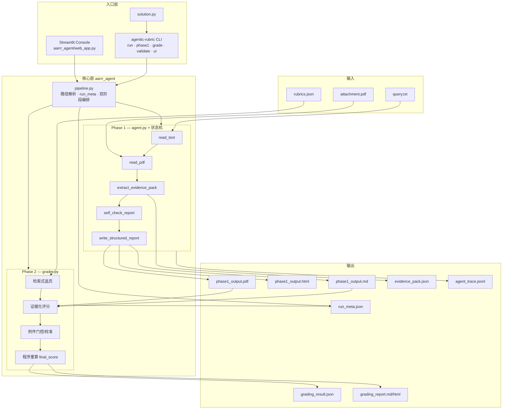

# agentic-rubric-runner

可审计的文档约束型 Agent 流水线：读取任务说明与 PDF 附件，生成结构化中文报告，按 Rubric 自动评分，并输出完整工具调用轨迹。

适用于「给定参考文档 + 明确任务要求 + 结构化评分标准」的文档生成与质量评估场景，例如增长指标方案、研究报告摘要、合规性检查等。

| 项目信息 | |
|----------|--|
| 版本 | 0.5.0 |
| Python | 3.10+（Streamlit Cloud 推荐 3.11） |
| 默认模型 | DeepSeek `deepseek-chat`（OpenAI 兼容 API） |
| 许可证 | MIT |

| 资源 | 链接 |
|------|------|
| 展示页 | https://bosprimigenious.github.io/agentic-rubric-runner/ |
| 源码 | https://github.com/bosprimigenious/agentic-rubric-runner |
| Deploy Console | https://agentic-rubric-runner.streamlit.app/ |

**产品入口**

| 层级 | 入口 | 说明 |
|------|------|------|
| **Primary — CLI** | `agentic-rubric` | 核心产品：本地运行、批处理、可复现评审、CI 集成 |
| **Optional — Web UI** | `agentic-rubric ui` / Streamlit | 可选演示层：在线体验与面试展示，需额外安装 `[web]` |

CLI 是本项目的核心入口；Streamlit Web 控制台与 CLI 共用同一套 `pipeline` / `agent` / `grader` 后端，但不属于默认安装依赖。

---

## 功能概览

- **Phase 1 — 报告生成**：Agent 通过 Function Calling 依次读取 `query.txt`、PDF 附件，生成 Markdown 报告；程序解析固定章节后套入管理层 HTML/CSS 模板，导出 PDF（WeasyPrint，失败回退 ReportLab），同时保留 `.md` / `.html` 供审计与预览。
- **Phase 2 — Rubric 评分**：根据 `rubrics.json` 对 Phase 1 产物逐条打分，输出结构化 `grading_result.json`。
- **可审计轨迹**：每一步 LLM 请求与工具调用写入 `agent_trace.jsonl`，支持事后回放与排错。
- **程序重算分数**：`final_score` 由程序按权重公式计算，不直接信任模型给出的总分。
- **双入口**：Typer CLI（核心）与 Streamlit Web 控制台（可选）共用同一套 `pipeline` / `agent` / `grader` 后端。
- **分步执行**：支持只跑 Phase 1、只跑 Phase 2，或在 Web 上分步触发。

---

## 架构

CLI、Web 与 `solution.py` 共用同一套 `pipeline` / `agent` / `grader` 后端，不通过子进程调脚本。



| 层 | 模块 | 职责 |
|----|------|------|
| **入口** | `cli.py` | `run` / `phase1` / `grade` / `validate` / `inspect-trace` / `init` / `ui` |
| **入口** | `web_app.py` | 分步调用 `run_phase1_pipeline` + `run_phase2_pipeline` |
| **编排** | `pipeline.py` | 输出路径、`run_meta`、Phase 1 / 2 串联 |
| **Phase 1** | `agent.py` + `phase1_state.py` | 状态机约束工具顺序：`read_text` → `read_pdf` → `extract_evidence_pack` → `write_structured_report` |
| **Phase 2** | `grader.py` + `attachment_relevance.py` | 检索式选页、证据化评分、附件门控、程序重算 `final_score` |
| **工具** | `tools.py` / `evidence.py` / `structured_report.py` | 证据包、结构化报告、HTML/PDF 渲染 |

**Phase 1 约束**

- Agent 只能访问 `query.txt` 与附件 PDF，**不读取** `rubrics.json`（避免评分标准泄露到生成阶段）。
- 状态机强制工具顺序；`write` 之后禁止再调工具；须输出 `PHASE1_DONE`。
- 报告关键事实须引用证据编号 `[E01]`，证据来自 `evidence_pack.json`。

**Phase 2 流程**

- 读取 Phase 1 产物（Markdown / PDF）与 `rubrics.json`。
- 检索式选取附件相关页（非简单截断）；每项输出 `evidence` / `missing`。
- 附件领域不匹配时程序门控压低分数；`final_score` 由程序重算。

---

## 安装

默认安装仅包含 **CLI 核心依赖**（`run` / `phase1` / `grade` / `validate` / `inspect-trace` 等完整可用）。如需 Streamlit Web UI，请额外安装 `[web]` extra。

### 从 GitHub 安装（推荐）

```bash
pip install "git+https://github.com/bosprimigenious/agentic-rubric-runner.git"
```

固定版本：

```bash
pip install "agentic-rubric-runner @ git+https://github.com/bosprimigenious/agentic-rubric-runner.git@v0.4.0"
```

### 可选：Web UI

```bash
pip install "agentic-rubric-runner[web] @ git+https://github.com/bosprimigenious/agentic-rubric-runner.git"
```

安装后可运行 `agentic-rubric ui` 或 `streamlit run app.py`。

### 全局 CLI（pipx）

```bash
pipx install "git+https://github.com/bosprimigenious/agentic-rubric-runner.git"
```

需要 Web 时：

```bash
pipx install "agentic-rubric-runner[web] @ git+https://github.com/bosprimigenious/agentic-rubric-runner.git"
```

### 本地开发

```bash
git clone https://github.com/bosprimigenious/agentic-rubric-runner.git
cd agentic-rubric-runner
pip install -e ".[dev]"          # CLI + 测试工具
pip install -e ".[dev,web]"      # 含 Streamlit Web UI
```

### 依赖清单文件说明

| 文件 | 用途 |
|------|------|
| `requirements.txt` | CLI / 核心运行时（**不是** Streamlit Cloud 默认文件） |
| `requirements-web.txt` | 核心 + Streamlit（本地 Web 开发） |
| `requirements-streamlit.txt` | Streamlit Cloud 部署专用（指向 `requirements-web.txt`） |

安装 CLI 请使用 `pip install .` 或 `pip install -e .`，不要直接 `pip install -r requirements.txt` 后再误以为已包含 Web。

---

## 快速开始

### 1. 配置 API Key

```bash
cp .env.example .env
# 编辑 .env，填入 DEEPSEEK_API_KEY
```

PowerShell 临时设置：

```powershell
$env:DEEPSEEK_API_KEY = "sk-..."
```

可选环境变量：

| 变量 | 默认值 | 说明 |
|------|--------|------|
| `DEEPSEEK_API_KEY` | — | DeepSeek API 密钥（CLI 必需） |
| `DEEPSEEK_BASE_URL` | `https://api.deepseek.com` | OpenAI 兼容端点 |
| `DEEPSEEK_MODEL` | `deepseek-chat` | 模型名称 |
| `PDF_RENDERER` | `auto` | PDF 渲染器：`auto`（WeasyPrint → ReportLab）、`html`、`reportlab` |

### 2. 运行完整流水线

仓库自带 `fixtures/` 样例数据，可直接验证：

```bash
agentic-rubric run \
  --query fixtures/query.txt \
  --pdf fixtures/attachment.pdf \
  --rubrics fixtures/rubrics.json
```

输出写入 `outputs/<run_id>/`，包含 PDF、评分 JSON、审计轨迹等。

### 3. 校验评分结果

```bash
agentic-rubric validate outputs/<run_id>/grading_result.json
```

### 4. 查看 Agent 轨迹

```bash
agentic-rubric inspect-trace outputs/<run_id>/agent_trace.jsonl
```

### 5. 生成 Agent 运行评分（可选）

```bash
agentic-rubric eval-run \
  --out outputs/<run_id> \
  --rubrics fixtures/rubrics.json
```

该命令读取一次已完成运行的产物，生成 `agent_eval.json`，从 Phase 1 执行、Phase 2 评分、任务成功率、事实可追溯、鲁棒性、效率与安全边界七个维度给出 run-level 分数。

### 6. 运行 Benchmark（可选）

```bash
cp fixtures/benchmarks/agent_cases.example.json fixtures/benchmarks/agent_cases.json
# 编辑 agent_cases.json，把 .example 占位文件替换为真实存在的 query/pdf/rubrics

agentic-rubric bench \
  --manifest fixtures/benchmarks/agent_cases.json \
  --out outputs/bench
```

Benchmark 会逐个执行 manifest 中的 case，每个 case 写入独立目录，并在 `outputs/bench/` 下生成 `agent_benchmark_result.json` 和 `agent_benchmark_report.md`。

### 7. 启动 Web 控制台（可选，需 `[web]`）

```bash
pip install -e ".[web]"   # 若尚未安装 Web 依赖
agentic-rubric ui
# 或
streamlit run app.py
```

---

## CLI 命令参考

| 命令 | 说明 |
|------|------|
| `run` | Phase 1 + Phase 2 完整流水线 |
| `phase1` | 仅生成报告（不读取 rubrics） |
| `grade` | 仅 Phase 2 评分（需已有 Phase 1 产物） |
| `validate` | 校验 `grading_result.json` 结构与分数一致性 |
| `eval-run` | 对一次已完成运行生成 `agent_eval.json` |
| `bench` | 按 manifest 运行 Agent Benchmark case suite |
| `inspect-trace` | 格式化查看 `agent_trace.jsonl` |
| `init` | 在当前目录生成任务模板（query / rubrics 骨架） |
| `ui` | 启动 Streamlit 文档评审控制台（需 `[web]` extra） |

**常用选项**

```bash
# 指定输出目录
agentic-rubric run --query q.txt --pdf doc.pdf --rubrics rubrics.json --out outputs/demo

# 分步执行
agentic-rubric phase1 --query q.txt --pdf doc.pdf --out outputs/demo
agentic-rubric grade --rubrics rubrics.json --phase1-md outputs/demo/phase1_output.md --out outputs/demo

# 切换模型
agentic-rubric run ... --model deepseek-chat

# 对单次运行做 Agent 级评分
agentic-rubric eval-run --out outputs/demo --rubrics rubrics.json

# 运行 benchmark case suite
agentic-rubric bench --manifest fixtures/benchmarks/agent_cases.json --out outputs/bench
```

`solution.py` 为兼容入口，等价于 `agentic-rubric run`。

---

## Web 控制台

**Deploy Console：** [agentic-rubric-runner.streamlit.app](https://agentic-rubric-runner.streamlit.app/)

**文档评审控制台** 提供与 CLI 相同的后端能力：

1. 上传 `query.txt`、PDF 附件、`rubrics.json`
2. 在页面输入 DeepSeek API Key（密钥仅存于当前会话）
3. 运行 Phase 1（报告生成）与 Phase 2（Rubric 评分）
4. 查看评分摘要，下载 PDF / JSON / 审计轨迹（下载不触发重新运行）

本地启动：`agentic-rubric ui` 或 `streamlit run app.py`

### Streamlit Cloud 部署

云端部署推荐配置：Main file 为 `app.py`，Requirements file 为 `requirements-streamlit.txt`，Python 版本为 3.11，Visibility 设为 Public。

如果页面空白、只有灰色背景、控制台出现 `Unable to preload CSS`，通常是 Streamlit Cloud 权限或配置问题。完整部署步骤与排障手册见 [docs/streamlit_deploy.md](docs/streamlit_deploy.md)。

---

## 输入格式

### query.txt

纯文本任务描述，说明期望 Agent 产出的文档类型、结构与覆盖范围。示例见 `fixtures/query.txt`。

### attachment.pdf

参考文档。Agent 在 Phase 1 中通过 `read_pdf` 提取文本；评分阶段也会读取 PDF 以核对事实引用。

### rubrics.json

结构化评分标准，顶层字段：

```json
{
  "rubric_summary": "评分标准总体说明",
  "rubric": {
    "hard_constraints": [ ... ],
    "soft_constraints": [ ... ],
    "optional_constraints": [ ... ]
  }
}
```

每条约束包含：

| 字段 | 说明 |
|------|------|
| `description` | 约束描述 |
| `score_0` / `score_1` | 0 分与 1 分的判定标准 |
| `needs_reference` | 是否需对照 PDF 事实（`"是"` / `"否"`） |
| `reference_facts` | 参考事实摘要（`needs_reference` 为是时使用） |
| `fact_source` | 事实出处（页码或章节） |

评分项 ID 规则：硬约束 `H01`…、软约束 `S01`…、可选约束 `O01`…

---

## 输出格式

默认输出目录：`outputs/<run_id>/`（`run_id` 格式 `YYYYMMDD_HHMMSS`）

| 文件 | 说明 |
|------|------|
| `phase1_output.md` | Agent 生成的 Markdown 报告 |
| `phase1_output.html` | 管理层 HTML 模板渲染（可直接浏览器打开） |
| `phase1_output.pdf` | WeasyPrint 导出 PDF（失败时回退 ReportLab） |
| `grading_result.json` | Phase 2 评分结果（含逐条 reason） |
| `grading_report.md` | 评审报告（管理层摘要、缺口、改进建议） |
| `grading_report.html` | 评审报告 HTML 版（可直接浏览器打开） |
| `agent_trace.jsonl` | 每行一条 JSON，记录 LLM 与工具调用 |
| `run_meta.json` | 运行元数据（耗时、输入哈希、模型、状态） |
| `agent_eval.json` | `eval-run` 或 `bench` 生成的 Agent 级运行评分 |

Benchmark 汇总目录额外包含：

| 文件 | 说明 |
|------|------|
| `agent_benchmark_result.json` | 多 case 聚合结果：总分、通过率、分类分、失败 taxonomy、release gate |
| `agent_benchmark_report.md` | 面向人工审阅的 Benchmark 报告 |
| `<case_id>/<run_id>/` | 每个 case 的独立运行目录，包含该 case 的报告、评分、trace、meta 和 `agent_eval.json` |

`grading_result.json` 主要字段：

```json
{
  "final_score": 93.5,
  "score_breakdown": {
    "hard_score": 10, "hard_max": 10,
    "soft_score": 8, "soft_max": 9,
    "optional_score": 2, "optional_max": 3
  },
  "hard_constraints": [{ "id": "H01", "score": 1, "reason": "..." }],
  "soft_constraints": [...],
  "optional_constraints": [...]
}
```

---

## 日志与审计

本项目的排障核心是三个文件：

| 文件 | 主要用途 | 关键字段 |
|------|----------|----------|
| `agent_trace.jsonl` | 回放 Agent 工具行为 | `step`、`tool`、`args_preview`、`status`、`duration_ms`、`phase1_state`、`error` |
| `run_meta.json` | 复现一次运行 | `run_id`、`model`、`status`、`duration_seconds`、`input_hash`、`outputs` |
| `agent_eval.json` | 判断一次运行是否达标 | `agent_score`、`report_score`、`dimensions`、`failure_types`、`details` |

常见排障路径：

1. `grading_result.json` 分数异常：先看 `grading_report.md` 的主要缺口，再看 `agent_eval.json` 的 `failure_types`。
2. Agent 没生成报告：看 `agent_trace.jsonl` 最后一条工具调用和 `phase1_state`。
3. 附件离题或事实不可追溯：看 `grading_result.json` 中是否出现“程序门控”，再看 `agent_eval.json` 的 `groundedness` 详情。
4. Benchmark 阻断发布：看 `agent_benchmark_result.json` 的 `release.failures` 和 `failure_taxonomy`。
5. 需要复现：用 `run_meta.json` 的输入哈希、模型名、输出文件名和 trace 定位对应 run。

---

## Agent Benchmark 规划

当前 Benchmark 已具备最小闭环：

- `bench` 命令读取 manifest 并逐 case 运行。
- 每个 case 独立输出，避免互相覆盖。
- 每次运行生成 `agent_eval.json`。
- Benchmark 汇总生成 JSON 与 Markdown 报告。
- 支持 release gate、case severity、owner、business impact 等生产字段。

后续规划：

| 阶段 | 目标 | 关键工作 |
|------|------|----------|
| Slice 1 | 稳定 run-level evaluator | 补齐更多确定性检查、完善 `agent_eval.json` schema |
| Slice 2 | 扩充 case suite | 增加 happy path、离题附件、坏 PDF、噪声 PDF、rubric 变体、对抗 query |
| Slice 3 | 证据校验升级 | 从证据 ID 检查升级为段落级 citation validator |
| Slice 4 | 生产门禁 | 支持 baseline 对比、回归阈值、CI 阻断 |
| Slice 5 | LLM judge 校准 | 引入 golden set、人审抽样、judge disagreement 统计 |

详细标准见 [`docs/agent_scoring_upgrade.md`](docs/agent_scoring_upgrade.md)。

---

## 评分公式

三类约束按权重折算为 0–100 分，分母从 `rubrics.json` 动态计算：

```
final_score =
  (hard_score / hard_max) × 50
+ (soft_score / soft_max) × 30
+ (optional_score / optional_max) × 20
```

- **硬约束**（hard）：必须满足的核心要求，权重 50%
- **软约束**（soft）：质量区分项，权重 30%
- **可选约束**（optional）：加分项，权重 20%

若某一类约束在 rubrics 中为空，对应项不参与计算（动态调整有效分母）。程序在写入前强制重算 `final_score`，与模型原始输出不一致时以程序结果为准。

如需将当前“文档评分”升级为更完整的 Agent Benchmark，请参考
[`docs/agent_scoring_upgrade.md`](docs/agent_scoring_upgrade.md) 与
[`fixtures/benchmarks/agent_cases.example.json`](fixtures/benchmarks/agent_cases.example.json)。该标准覆盖 Phase 1 执行、Phase 2 评分、任务成功率、事实可追溯、鲁棒性、效率成本与安全边界。

---

## 错误码

| 代码 | 含义 | 常见原因 |
|------|------|----------|
| E001 | API 失败或缺少 Key | 未设置 `DEEPSEEK_API_KEY` 或网络 / 配额问题 |
| E002 | PDF 无文本 | 扫描件或未提取到可解析文本 |
| E003 | Agent 未调用必要工具 | 跳过 `read_text` / `read_pdf` / `write_pdf_report` |
| E004 | 报告可能不完整 | 章节缺失等警告（不中断流水线） |
| E005 | 评分 JSON 无效 | Phase 2 输出无法通过 Pydantic 校验 |
| E006 | 中文字体缺失 | 本地或云端未安装 CJK 字体 |

---

## 项目结构

```
agentic-rubric-runner/
├── aarrr_agent/              # 核心 Python 包
│   ├── agent.py              # Phase 1 Agent 工具循环
│   ├── benchmark.py          # Agent eval-run / bench 评测与汇总
│   ├── grader.py             # Phase 2 Rubric 评分
│   ├── grading_report.py     # 评审报告、总评清洗、管理层摘要
│   ├── pipeline.py           # 双阶段编排与输出路径
│   ├── tools.py              # read_text / read_pdf / write_pdf_report
│   ├── html_report.py        # Jinja2 管理层 HTML 模板
│   ├── html_pdf.py           # WeasyPrint PDF + ReportLab fallback
│   ├── md_report_parser.py   # Markdown → 结构化报告
│   ├── pdf_gen.py            # ReportLab PDF 渲染（fallback）
│   ├── templates/            # executive_report.html
│   ├── assets/               # executive_report.css
│   ├── cli.py                # Typer CLI
│   ├── web_app.py            # Streamlit UI
│   ├── schemas.py            # Pydantic 数据模型
│   ├── validation.py         # 评分结果校验
│   └── ...
├── app.py                    # Streamlit Cloud 入口
├── solution.py               # run 兼容入口
├── fixtures/                 # 样例 query / PDF / rubrics
│   └── benchmarks/           # Agent Benchmark manifest 示例
├── docs/                     # GitHub Pages 静态站
├── tests/                    # pytest 测试套件
├── .github/workflows/        # CI、Pages、PyPI 发布
├── requirements.txt            # CLI / 核心依赖
├── requirements-web.txt        # 核心 + Streamlit
├── requirements-streamlit.txt  # Streamlit Cloud 部署
├── packages.txt                # 云端系统字体包
└── pyproject.toml
```

---

## 开发与测试

```bash
# 运行测试（当前 18 项）
pytest -q

# 打包 wheel
python -m build

# 代码格式化（dev 依赖）
ruff check aarrr_agent tests
black aarrr_agent tests
```

**CI/CD（GitHub Actions）**

| Workflow | 触发 | 作用 |
|----------|------|------|
| `ci.yml` | push / PR | pytest + 构建检查 |
| `pages.yml` | push `main` | 部署 GitHub Pages 展示页 |
| `publish.yml` | 推送 `v*` tag | 发布到 PyPI |

---

## 安全说明

- 勿将 `.env` 或真实 API Key 提交到版本库。
- Web 控制台由用户在浏览器输入 Key，不在 Streamlit Secrets 中存储。
- `fixtures/` 为演示材料；生产环境请替换为自有文档与评分标准。
- Agent 工具层对文件路径有白名单校验，限制可读文件范围。

---

## License

MIT — 详见 [LICENSE](LICENSE)。
