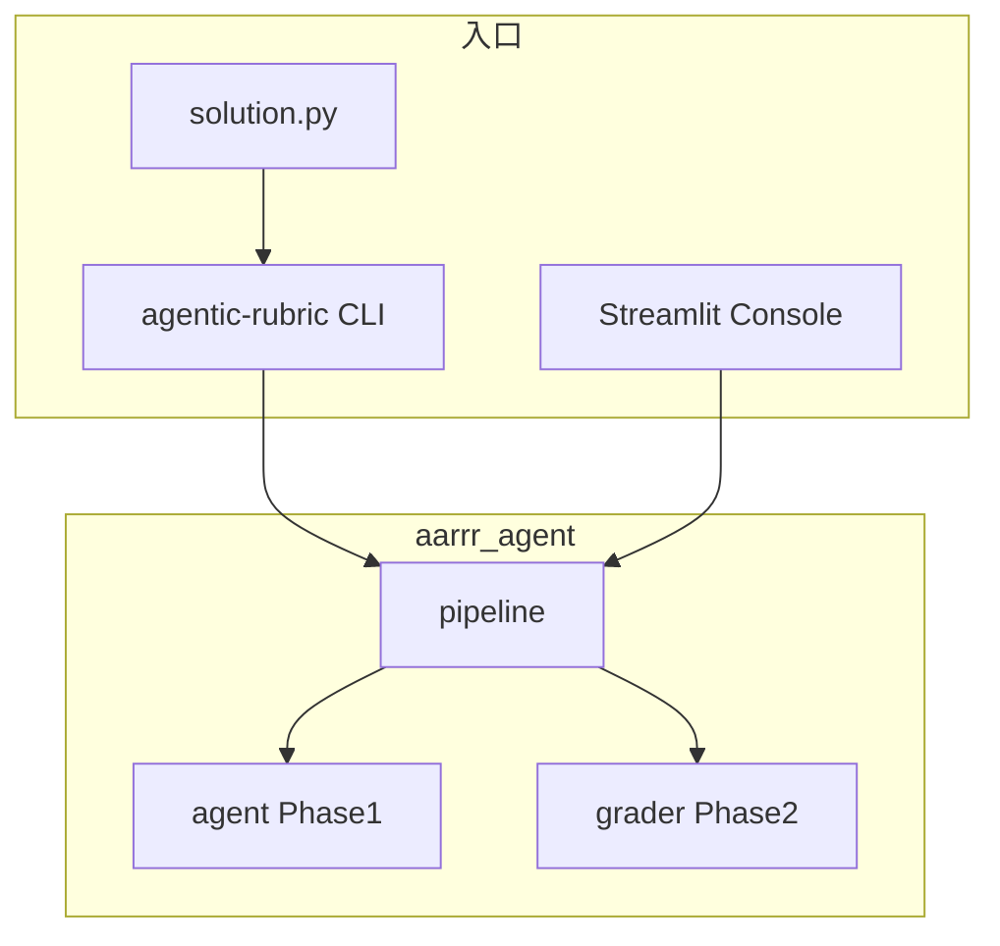

# agentic-rubric-runner

可审计的文档评审流水线：读取任务说明与 PDF 附件，生成结构化报告，按 Rubric 自动评分，并输出完整工具调用轨迹。

**版本** 0.4.0 · **Python** 3.10+ · **模型** DeepSeek `deepseek-chat`（OpenAI 兼容）

| 资源 | 链接 |
|------|------|
| 展示页 | https://bosprimigenious.github.io/agentic-rubric-runner/ |
| Web 控制台 | https://agentic-rubric-runner.streamlit.app/ |
| 源码 | https://github.com/bosprimigenious/agentic-rubric-runner |

---

## 架构



| 层 | 职责 |
|----|------|
| **CLI** | `run` / `phase1` / `grade` / `validate` / `inspect-trace` / `ui` |
| **Web** | `aarrr_agent/web_app.py`，分步调用 `run_phase1_pipeline` + `run_phase2_pipeline` |
| **Pipeline** | 路径解析、`run_meta`、双阶段编排 |
| **Agent** | Function Calling：`read_text` → `read_pdf` → `write_pdf_report` |
| **Grader** | 优先读 `.md` 评分，程序重算 `final_score` |

CLI 与 Web **共用同一套** `pipeline` / `agent` / `grader`，不通过子进程调脚本。

---

## 安装

> 安装 Web 能力需带 `[web]`，否则 `agentic-rubric ui` 缺少 Streamlit。

```bash
# 推荐：GitHub 在线安装
pip install "agentic-rubric-runner[web] @ git+https://github.com/bosprimigenious/agentic-rubric-runner.git"

# 全局 CLI（pipx）
pipx install "agentic-rubric-runner[web] @ git+https://github.com/bosprimigenious/agentic-rubric-runner.git"

# 开发
git clone https://github.com/bosprimigenious/agentic-rubric-runner.git
cd agentic-rubric-runner && pip install -e ".[dev,web]"
```

固定版本：`...@git+https://github.com/bosprimigenious/agentic-rubric-runner.git@v0.4.0`

---

## 快速开始

```bash
cp .env.example .env   # 填入 DEEPSEEK_API_KEY（CLI 用）

agentic-rubric run \
  --query fixtures/query.txt \
  --pdf fixtures/attachment.pdf \
  --rubrics fixtures/rubrics.json

agentic-rubric validate outputs/<run_id>/grading_result.json
agentic-rubric ui
```

PowerShell 设置 Key：`$env:DEEPSEEK_API_KEY="sk-..."`

---

## CLI 命令

| 命令 | 说明 |
|------|------|
| `run` | Phase 1 + Phase 2 完整流水线 |
| `phase1` | 仅生成报告（不读 rubrics） |
| `grade` | 仅 Phase 2 评分 |
| `validate` | 校验 `grading_result.json` |
| `inspect-trace` | 查看 `agent_trace.jsonl` |
| `init` | 初始化任务目录模板 |
| `ui` | 启动 Streamlit 控制台 |

`solution.py` 等价于 `agentic-rubric run`（兼容入口）。

---

## Web 控制台

- 页面：**Document Evaluation Console**
- 公开 Demo：**用户自备 API Key**，不读取环境变量 / Secrets
- 部署：[Streamlit Cloud](https://share.streamlit.io/) → `app.py` + `requirements.txt` + `packages.txt`
- 本地：`agentic-rubric ui` 或 `streamlit run app.py`

---

## 输入 / 输出

**输入：** `query.txt` · `attachment.pdf` · `rubrics.json`

**输出目录**（默认 `outputs/<run_id>/`）：

```
phase1_output.md
phase1_output.pdf
grading_result.json
agent_trace.jsonl
run_meta.json
```

---

## 评分

```
final_score =
  (hard_score / hard_max) × 50
+ (soft_score / soft_max) × 30
+ (optional_score / optional_max) × 20
```

`hard_max` / `soft_max` / `optional_max` 从 `rubrics.json` 动态计算；程序强制重算，不信任模型 breakdown。

---

## 错误码

| 代码 | 含义 |
|------|------|
| E001 | API 失败或缺少 Key |
| E002 | PDF 无文本 |
| E003 | Agent 未调用必要工具 |
| E004 | 报告可能不完整（警告） |
| E005 | 评分 JSON 无效 |
| E006 | 中文字体缺失 |

---

## 项目结构

```
agentic-rubric-runner/
├── aarrr_agent/          # 核心包（agent / grader / pipeline / cli / web_app）
├── app.py                # Streamlit Cloud 入口
├── solution.py           # run 兼容入口
├── fixtures/             # 样例数据
├── docs/                 # GitHub Pages
├── tests/
├── requirements.txt      # Streamlit Cloud + pip 依赖
├── packages.txt          # 云端中文字体 fonts-noto-cjk
└── pyproject.toml
```

---

## 开发

```bash
pytest -q
python -m build
```

CI：push 时 pytest + 打包；`main` 部署 GitHub Pages；`v*` tag 可发 PyPI。

---

## 安全

- 勿提交 `.env` 或真实 API Key
- Web 公开 Demo 由用户页面输入 Key
- `fixtures/` 为示例材料，生产环境请替换自有文档

---

## License

MIT
