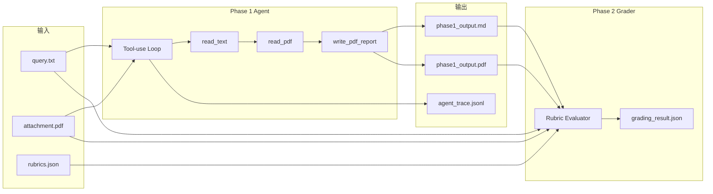

# agentic-rubric-runner

基于 Function Calling 的文档约束型 Agent 流水线：读取任务说明与 PDF 附件，自动生成结构化报告，再按 Rubric 标准完成自动评分，并输出可审计的工具调用轨迹。

典型用途包括尽职调查材料审核、合规文档检查、提案质量评估，以及任何「给定参考文档 + 明确评分标准 → 生成产物并打分」的自动化场景。

**当前版本：** 0.4.0a1  
**Python：** 3.10+  
**默认模型：** DeepSeek `deepseek-chat`（兼容 OpenAI SDK）

**在线资源：**

- 项目展示页（GitHub Pages）：https://bosprimigenious.github.io/agentic-rubric-runner/
- Streamlit 在线 Demo：https://your-streamlit-demo-url（部署后替换）

---

## 功能概览

| 能力 | 说明 |
|------|------|
| Phase 1 Agent | 通过 `read_text` / `read_pdf` / `write_pdf_report` 工具自主完成任务，禁止直接裸调 LLM 返回答案 |
| Phase 2 Grader | 依据 `rubrics.json` 对 Phase 1 产物逐条评分，输出结构化 JSON |
| PDF 生成 | Markdown 报告经 ReportLab 渲染为中文 PDF，同时保留 `.md` 源文件 |
| 审计 Trace | 每次工具调用记录 step、时间戳、耗时、参数与结果预览 |
| CLI | `pip install` 后即可使用 `agentic-rubric` 命令（含独立 `phase1` 子命令） |
| Web UI | Streamlit 分步执行 Phase 1 / Phase 2，Phase 2 失败时仍可下载 PDF |
| GitHub Pages | 静态项目介绍与使用说明 |

---

## 架构



**Phase 1 安全边界：** Agent 只能读取 `query.txt` 与附件 PDF，不能读取 `rubrics.json`，避免评分标准泄露到生成阶段。

**Phase 2 文档来源：** 优先使用 `phase1_output.md` 评分（结构完整）；若 Markdown 不存在，则回退到 PDF 文本抽取。

---

## 快速开始

### 1. 安装

```bash
git clone https://github.com/bosprimigenious/agentic-rubric-runner.git
cd agentic-rubric-runner

python -m venv .venv
source .venv/bin/activate          # Windows: .venv\Scripts\activate

pip install -e ".[dev,web]"
```

### 2. 配置 API Key

复制环境变量模板并填入密钥：

```bash
cp .env.example .env
```

`.env` 示例：

```env
DEEPSEEK_API_KEY=sk-your-key-here
DEEPSEEK_BASE_URL=https://api.deepseek.com
DEEPSEEK_MODEL=deepseek-chat
```

CLI 与 Streamlit 启动时会自动加载项目根目录下的 `.env`（不会覆盖已设置的环境变量）。

### 3. 运行示例任务

仓库自带一套 AARRR 增长指标方案样例（`fixtures/`）：

```bash
agentic-rubric run \
  --query fixtures/query.txt \
  --pdf fixtures/attachment.pdf \
  --rubrics fixtures/rubrics.json
```

未指定 `--out` 时，结果写入 `outputs/<run_id>/`，避免覆盖历史运行记录。

### 4. 查看结果

```bash
agentic-rubric validate outputs/<run_id>/grading_result.json
agentic-rubric inspect-trace outputs/<run_id>/agent_trace.jsonl
```

---

## 使用方式

### CLI（推荐）

安装后提供 `agentic-rubric` 命令（别名 `aarrr-agent`）。

#### `phase1` — 只运行 Agent 生成报告

不读取 `rubrics.json`，仅生成 Phase 1 产物：

```bash
agentic-rubric phase1 \
  --query fixtures/query.txt \
  --pdf fixtures/attachment.pdf \
  --out outputs/demo
```

输出：`phase1_output.md`、`phase1_output.pdf`、`agent_trace.jsonl`、`run_meta.json`

#### `run` — 完整流水线

```bash
agentic-rubric run \
  --query fixtures/query.txt \
  --pdf fixtures/attachment.pdf \
  --rubrics fixtures/rubrics.json \
  --out outputs/demo
```

| 参数 | 说明 |
|------|------|
| `--query` | 任务描述文本文件 |
| `--pdf` | 参考附件 PDF |
| `--rubrics` | 评分标准 JSON |
| `--out` | 输出目录；省略时默认为 `outputs/<run_id>/` |
| `--model` | 模型名称，默认 `deepseek-chat` |
| `--skip-phase2` | 仅执行 Phase 1 |
| `--phase1-out` | 自定义 Phase 1 PDF 路径 |
| `--grading-out` | 自定义评分 JSON 路径 |
| `--trace-out` | 自定义 trace 文件路径 |

#### `grade` — 单独评分

在已有 Phase 1 产物时，仅运行 Phase 2：

```bash
agentic-rubric grade \
  --phase1 outputs/demo/phase1_output.pdf \
  --query fixtures/query.txt \
  --attachment fixtures/attachment.pdf \
  --rubrics fixtures/rubrics.json \
  --out outputs/demo/grading_result.json
```

#### `validate` — 校验评分结果

```bash
agentic-rubric validate outputs/demo/grading_result.json
```

使用 Pydantic 校验 JSON 结构，并打印分数摘要表。

#### `inspect-trace` — 查看工具调用轨迹

```bash
agentic-rubric inspect-trace outputs/demo/agent_trace.jsonl
```

#### `init` — 初始化任务目录

```bash
agentic-rubric init my-task
```

生成 `query.txt`、`rubrics.json` 模板、`outputs/` 目录；若存在 `fixtures/attachment.pdf` 会自动复制为示例附件。

#### `ui` — 启动 Web 界面

```bash
agentic-rubric ui
```

等价于 `streamlit run app.py`。

### 脚本入口

根目录 `solution.py` 是 `agentic-rubric run` 的快捷入口：

```bash
python solution.py \
  --query fixtures/query.txt \
  --pdf fixtures/attachment.pdf \
  --rubrics fixtures/rubrics.json
```

`validate_grading.py` 等价于 `agentic-rubric validate`。

### Web UI

```bash
pip install -e ".[web]"
streamlit run app.py
# 或
agentic-rubric ui
```

在侧边栏配置 API Key 与模型，上传三个输入文件后点击 **Run Pipeline**。

**执行流程（方案 B — 分步）：**

1. **Phase 1** — 调用 `run_phase1_pipeline()`，生成 PDF / Markdown / trace，可立即下载
2. **Phase 2** — 调用 `run_phase2_pipeline()`，输出评分 JSON；若本阶段失败，Phase 1 产物仍可下载

Web 层直接调用 `aarrr_agent.pipeline` 中的分步函数，不通过子进程调用脚本，也不在日志中输出 API Key。

#### Streamlit Cloud 部署

1. 在 [Streamlit Cloud](https://streamlit.io/cloud) 连接 GitHub 仓库 `bosprimigenious/agentic-rubric-runner`
2. **Main file** 选择 `app.py`
3. **Dependencies** 使用 `requirements-web.txt`（或 `pyproject.toml` 的 `[web]` extra）
4. 在 **Secrets** 中设置：
   - `DEEPSEEK_API_KEY`
   - `DEEPSEEK_BASE_URL`（可选，默认 `https://api.deepseek.com`）
5. 点击 **Deploy**

上传文件仅写入临时目录，不会提交到仓库。

---

## 输入与输出

### 输入文件

| 文件 | 格式 | 用途 |
|------|------|------|
| `query.txt` | 纯文本 | 任务描述与交付要求 |
| `attachment.pdf` | PDF | 参考文档，Agent 与评分器均可读取 |
| `rubrics.json` | JSON | 硬约束 / 软约束 / 可选项及评分说明 |

`rubrics.json` 结构示例：

```json
{
  "rubric_summary": "评分标准概述",
  "rubric": {
    "hard_constraints": [
      {
        "description": "约束描述",
        "score_0": "0 分说明",
        "score_1": "1 分说明",
        "needs_reference": "是",
        "reference_facts": "...",
        "fact_source": "..."
      }
    ],
    "soft_constraints": [
      {
        "description": "...",
        "score_0": "...",
        "score_1": "...",
        "score_2": "...",
        "score_3": "...",
        "score_4": "..."
      }
    ],
    "optional_constraints": [
      {
        "description": "...",
        "score_0": "...",
        "score_1": "..."
      }
    ]
  }
}
```

### 输出目录

一次完整 `run` 的典型产物：

```
outputs/20260615_153000/
├── phase1_output.md       # Agent 生成的 Markdown 源文件
├── phase1_output.pdf      # 渲染后的 PDF 报告
├── grading_result.json    # Phase 2 评分结果
├── agent_trace.jsonl      # 工具调用审计日志（JSONL，每行一步）
└── run_meta.json          # 运行元数据（run_id、输入哈希、耗时等）
```

#### `grading_result.json`

```json
{
  "hard_constraints": [{"id": "H01", "score": 1, "reason": "..."}],
  "soft_constraints": [{"id": "S01", "score": 4, "reason": "..."}],
  "optional_constraints": [{"id": "O01", "score": 1, "reason": "..."}],
  "score_breakdown": {
    "hard_score": 15,
    "hard_max": 15,
    "soft_score": 20,
    "soft_max": 24,
    "optional_score": 2,
    "optional_max": 3,
    "final_score": 91.67
  },
  "overall_comment": "..."
}
```

#### `agent_trace.jsonl` 单条记录

```json
{
  "step": 2,
  "tool": "read_pdf",
  "status": "ok",
  "timestamp": "2026-06-15T14:30:00Z",
  "duration_ms": 73,
  "args_preview": {"path": "fixtures/attachment.pdf"},
  "result_preview": "[PAGE 1]\n..."
}
```

`write_pdf_report` 的 `content` 参数在 trace 中仅保留前 120 字符预览，避免日志过大。

#### `run_meta.json`

```json
{
  "run_id": "20260615_153000",
  "model": "deepseek-chat",
  "status": "completed",
  "duration_seconds": 60.56,
  "phase1_turns": 3,
  "final_score": 95.24,
  "input_hash": {
    "query": "sha256:...",
    "pdf": "sha256:...",
    "rubrics": "sha256:..."
  },
  "outputs": {
    "pdf": "phase1_output.pdf",
    "markdown": "phase1_output.md",
    "grading": "grading_result.json",
    "trace": "agent_trace.jsonl"
  }
}
```

---

## 评分规则

### 单项打分

| 类型 | 分值范围 | 说明 |
|------|----------|------|
| `hard_constraints` | 0 或 1 | 硬性要求，不满足即 0 分 |
| `soft_constraints` | 0–4 | 按 rubric 中各档位描述评判质量 |
| `optional_constraints` | 0 或 1 | 加分项，有则 1，无则 0 |

每条约束在评分结果中带有 `H01` / `S01` / `O01` 形式的 ID，与 `rubrics.json` 中的条目顺序对应。

### 总分计算

`hard_max`、`soft_max`、`optional_max` 根据 `rubrics.json` **动态计算**，不硬编码条数：

```
hard_max     = hard_constraints 条数
soft_max     = soft_constraints 条数 × 4
optional_max = optional_constraints 条数

final_score =
  (hard_score / hard_max) × 50
+ (soft_score / soft_max) × 30
+ (optional_score / optional_max) × 20
```

程序在 Phase 2 结束后通过 `recalculate_scores()` **强制重算** `final_score`，不信任模型返回的 breakdown 数值。缺失的评分项自动补 0 分。

---

## 可靠性与校验

### API 调用

- 统一封装于 `aarrr_agent.llm.call_chat_completion`
- 默认超时 120 秒，失败重试 3 次
- Phase 1 在 API 彻底失败前会保存 `agent_trace_emergency.jsonl`

### 报告完整性（Phase 1）

`write_pdf_report` 写入前会检查报告是否包含 15 个关键章节词（如「北极星指标」「AARRR」「黄色预警」等），并校验最短长度（默认 ≥ 1500 字符）。不完整时输出 `[E004 警告]`，不阻断流程。

### 路径白名单（Phase 1）

`Phase1ToolContext` 限制 Agent 只能：

- **读取：** `query.txt`、附件 PDF
- **写入：** 指定的 `phase1_output.pdf`（同时生成同目录 `.md`）

尝试读取 `rubrics.json` 或其他路径会抛出 `PermissionError`。

### 错误码

| 代码 | 含义 | 是否阻断 |
|------|------|----------|
| E001 | LLM/API 调用失败，或缺少 `DEEPSEEK_API_KEY` | 是 |
| E002 | PDF 文本抽取为空（常见于扫描件） | 是 |
| E003 | Agent 未调用全部必要工具 | 是 |
| E004 | 报告内容可能不完整 | 否（警告） |
| E005 | Grading JSON 解析或校验失败 | 是 |
| E006 | 未找到可用中文字体，无法生成 PDF | 是 |

中文字体按以下顺序查找：项目 `fonts/` 目录 → 系统 Noto / 微软雅黑 / 黑体等。

---

## 开发与测试

### 项目结构

```
agentic-rubric-runner/
├── aarrr_agent/
│   ├── agent.py          # Phase 1 tool-use 主循环
│   ├── grader.py         # Phase 2 评分与分数重算
│   ├── tools.py          # 工具实现、trace 记录、路径白名单
│   ├── pipeline.py       # 双阶段流水线与 run_meta
│   ├── cli.py            # Typer CLI
│   ├── llm.py            # LLM 超时与重试
│   ├── pdf_gen.py        # Markdown → PDF（ReportLab）
│   ├── validation.py     # 报告关键词完整性检查
│   ├── schemas.py        # Pydantic 数据模型
│   ├── errors.py         # 结构化错误码
│   ├── env.py            # .env 加载
│   └── config.py         # 常量配置
├── app.py                # Streamlit Web UI
├── solution.py           # run 命令快捷入口
├── validate_grading.py   # validate 命令快捷入口
├── fixtures/             # 样例输入（query / pdf / rubrics）
├── docs/                 # GitHub Pages 静态展示页
├── tests/                # pytest 单元测试
├── .github/workflows/    # CI 与 PyPI 发布
├── pyproject.toml
└── requirements.txt
```

### 运行测试

```bash
pytest -q
```

当前覆盖：分数重算、路径白名单、报告校验、CLI 导入、PDF 中文渲染、trace 格式。

### 本地打包

```bash
python -m build
pip install dist/agentic_rubric_runner-0.4.0a1-py3-none-any.whl
agentic-rubric --help
agentic-rubric phase1 --help
```

### CI/CD

- **CI**（`.github/workflows/ci.yml`）：`pip install -e ".[dev,web]"`、pytest、CLI help 冒烟、`python -m build`、上传 `dist/` artifact
- **GitHub Pages**（`.github/workflows/pages.yml`）：push `main` 时部署 `docs/` 至 https://bosprimigenious.github.io/agentic-rubric-runner/
- **发布**（`.github/workflows/publish.yml`）：推送 `v*` tag 时发布至 PyPI

```bash
git tag v0.4.0a1
git push origin v0.4.0a1
```

---

## 依赖

| 包 | 用途 |
|----|------|
| `openai` | DeepSeek API（OpenAI 兼容接口） |
| `pymupdf` | PDF 文本抽取 |
| `reportlab` | PDF 生成 |
| `pydantic` | 评分结果校验 |
| `typer` + `rich` | CLI 与终端输出 |
| `python-dotenv` | 加载 `.env` |
| `streamlit` | Web UI（可选，`[web]` extra） |

---

## 安全说明

- **不要**将 `.env` 或真实 API Key 提交到 Git 仓库
- Streamlit Cloud 通过 Secrets 注入 Key，不要在 `app.py` 中硬编码
- `fixtures/attachment.pdf` 为示例材料；生产环境请替换为你有权使用的文档
- GitHub Pages 为纯静态页面，不执行 Python、不存储密钥

---

## 常见问题

**Q: 为什么同时有 `.md` 和 `.pdf`？**  
Markdown 保留完整结构与表格，供 Phase 2 精确评分；PDF 是最终交付格式。

**Q: 可以换其他模型吗？**  
可以。通过 `--model` 或环境变量 `DEEPSEEK_MODEL` 指定，需兼容 OpenAI Chat Completions 与 Function Calling。

**Q: Windows 终端中文乱码？**  
CLI 已在 Windows 下尝试将 stdout 设为 UTF-8。若仍有问题，可在 PowerShell 中执行 `[Console]::OutputEncoding = [Text.UTF8Encoding]::UTF8`。

**Q: PDF 生成报 E006？**  
将 `NotoSansCJK-Regular.ttc` 放入 `fonts/` 目录，或确保系统已安装中文字体。

---

## License

MIT
