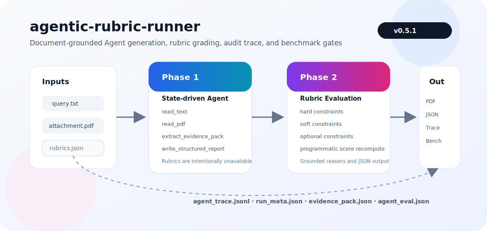

# agentic-rubric-runner

> Part of the Loop Engineering Ecosystem.

agentic-rubric-runner is the evaluation layer. It scores and audits generated documents, reports, and workflow artifacts.

For long-running AI work loops and runtime orchestration, see [LoopPilot](https://github.com/bosprimigenious/LoopPilot).

[](https://github.com/bosprimigenious/agentic-rubric-runner/releases/tag/v0.5.1)
[](https://pypi.org/project/agentic-rubric-runner/)
[](LICENSE)
[](https://agentic-rubric-runner.streamlit.app/)



可审计的文档约束型 Agent 流水线。它把“文档生成”和“Rubric 评分”拆成两个隔离阶段，提供可安装、可复现、可追踪的 Python 工具链：

1. **Phase 1: Agent 做题**  
   只读取 `query.txt` 和 PDF 附件，通过 function calling 工具生成报告产物，不读取 `rubrics.json`。

2. **Phase 2: Rubric 评分**  
   读取 Phase 1 输出、`rubrics.json`、`query.txt` 和附件 PDF，输出结构化 `grading_result.json`。

3. **Agent Benchmark**  
   在单次评分之外，支持 `eval-run` 和 `bench`，用于评价 Agent 运行质量、工具顺序、事实可追溯、鲁棒性和发布门禁。

## Project Info

| 项目 | 内容 |
|------|------|
| Package | `agentic-rubric-runner` |
| Current version | `0.5.1` |
| Python | `>=3.10`，推荐 3.11 |
| Default model | DeepSeek `deepseek-chat` via OpenAI-compatible API |
| License | MIT |

| 资源 | 链接 |
|------|------|
| PyPI | https://pypi.org/project/agentic-rubric-runner/ |
| GitHub Pages | https://bosprimigenious.github.io/agentic-rubric-runner/ |
| Deploy Console | https://agentic-rubric-runner.streamlit.app/ |
| Repository | https://github.com/bosprimigenious/agentic-rubric-runner |

## Why This Exists

普通 LLM 文档生成很容易出现三个问题：

- 生成阶段偷看评分标准，导致答案过拟合 rubric。
- 模型不调用工具，直接裸答，无法证明它真的读取了文件。
- 评分结果不可复算，模型自己编 `final_score`。

本项目用工程约束解决这些问题：

- Phase 1 与 Phase 2 严格隔离。
- Phase 1 是 **state-machine controlled function-calling Agent**。
- 每一步工具调用写入 `agent_trace.jsonl`。
- Phase 2 使用 `rubrics.json` 逐项评分，并由程序重算总分。
- 输出 `run_meta.json`、`evidence_pack.json`、`grading_result.json` 等审计产物。

## Installation

### PyPI

```bash
python -m pip install agentic-rubric-runner
agentic-rubric --help
```

固定版本：

```bash
python -m pip install "agentic-rubric-runner==0.5.1"
```

macOS/Homebrew Python 如果提示 `externally-managed-environment`，请使用虚拟环境：

```bash
python3 -m venv .venv-interview
source .venv-interview/bin/activate
python -m pip install --upgrade pip
python -m pip install agentic-rubric-runner
```

### Optional Web UI

```bash
python -m pip install "agentic-rubric-runner[web]"
agentic-rubric ui
```

### Local Development

```bash
git clone https://github.com/bosprimigenious/agentic-rubric-runner.git
cd agentic-rubric-runner
python -m pip install -e ".[dev]"
python -m pip install -e ".[dev,web]"
```

## Quick Start

准备三个文件：

```text
query.txt
基于AARRR模型的社交电商平台用户增长策略研究.pdf
rubrics.json
```

配置 DeepSeek API Key：

```bash
export DEEPSEEK_API_KEY="sk-..."
export DEEPSEEK_BASE_URL="https://api.deepseek.com"
```

Windows PowerShell：

```powershell
$env:DEEPSEEK_API_KEY = "sk-..."
$env:DEEPSEEK_BASE_URL = "https://api.deepseek.com"
```

运行完整两阶段流水线：

```bash
agentic-rubric run \
  --query query.txt \
  --pdf "基于AARRR模型的社交电商平台用户增长策略研究.pdf" \
  --rubrics rubrics.json \
  --out outputs/interview \
  --model deepseek-chat
```

验证评分结果：

```bash
agentic-rubric validate outputs/interview/grading_result.json
agentic-rubric inspect-trace outputs/interview/agent_trace.jsonl
```

仓库自带 fixtures，也可以直接跑：

```bash
agentic-rubric run \
  --query fixtures/query.txt \
  --pdf fixtures/attachment.pdf \
  --rubrics fixtures/rubrics.json \
  --out outputs/demo
```

## Phase 1: Agent 做题

Phase 1 的输入只有：

```text
query.txt
attachment.pdf
```

它不会读取 `rubrics.json`，避免评分标准泄露到生成阶段。

核心实现：

- `aarrr_agent/agent.py`: function-calling Agent loop
- `aarrr_agent/phase1_state.py`: 工具调用状态机
- `aarrr_agent/tools.py`: `read_text`、`read_pdf`、`extract_evidence_pack`、`write_structured_report`

从 `0.5.1` 开始，Phase 1 使用状态机驱动工具调用，不再依赖模型自己选择工具：

```text
START         -> read_text
NEED_PDF      -> read_pdf
NEED_EVIDENCE -> extract_evidence_pack
NEED_REPORT   -> write_structured_report
DONE          -> stop
```

每轮只暴露当前状态允许的工具，并通过 `tool_choice` 强制下一步工具。若某个 OpenAI-compatible provider 不支持强制 `tool_choice`，系统会降级为“只暴露当前工具 + auto”。

Phase 1 输出：

| 文件 | 说明 |
|------|------|
| `phase1_output.md` | Markdown 源报告 |
| `phase1_output.html` | HTML 预览 |
| `phase1_output.pdf` | 最终 PDF 报告 |
| `evidence_pack.json` | 附件事实证据包 |
| `agent_trace.jsonl` | 每一步工具调用轨迹 |
| `run_meta.json` | 输入哈希、模型、耗时、状态 |

## Phase 2: Rubric 评分

Phase 2 的输入是：

```text
phase1_output.*
rubrics.json
query.txt
attachment.pdf
```

核心实现：

- `aarrr_agent/grader.py`: 评分 prompt、JSON 校验、分数重算
- `aarrr_agent/grading_report.py`: 评审报告生成
- `aarrr_agent/attachment_relevance.py`: 附件领域门控
- `aarrr_agent/grading_calibration.py`: 保守校准

`rubrics.json` 是评分合同，包含：

| 类型 | 分值 | 用途 |
|------|------|------|
| `hard_constraints` | 0 / 1 | 硬性要求 |
| `soft_constraints` | 0 到 4 | 质量区分 |
| `optional_constraints` | 0 / 1 | 加分项 |

最终分数由程序重算，不信任模型输出的总分：

```text
final_score =
  hard_score / hard_max * 50
+ soft_score / soft_max * 30
+ optional_score / optional_max * 20
```

Phase 2 输出：

| 文件 | 说明 |
|------|------|
| `grading_result.json` | 结构化评分结果 |
| `grading_report.md` | 人类可读评审报告 |
| `grading_report.html` | HTML 评审报告 |

## CLI Reference

| 命令 | 说明 |
|------|------|
| `run` | Phase 1 + Phase 2 完整流水线 |
| `phase1` | 只运行 Phase 1，不读取 rubrics |
| `grade` | 只运行 Phase 2 |
| `validate` | 校验 `grading_result.json` |
| `inspect-trace` | 查看 `agent_trace.jsonl` |
| `eval-run` | 对一次已完成运行生成 `agent_eval.json` |
| `bench` | 运行 Agent benchmark case suite |
| `acceptance` | 对 benchmark manifest/result 执行 fail-closed 总门控 |
| `init` | 初始化任务目录模板 |
| `ui` | 启动 Streamlit Web 控制台 |

单独运行 Phase 2：

```bash
agentic-rubric grade \
  --phase1 outputs/interview/phase1_output.pdf \
  --rubrics rubrics.json \
  --query query.txt \
  --attachment "基于AARRR模型的社交电商平台用户增长策略研究.pdf" \
  --out outputs/interview/grading_result.json
```

## Agent Benchmark

单次运行评分：

```bash
agentic-rubric eval-run \
  --out outputs/interview \
  --rubrics rubrics.json
```

运行 benchmark suite：

```bash
agentic-rubric bench \
  --manifest fixtures/benchmarks/agent_cases.json \
  --out outputs/bench
```

统一门控入口：

```bash
scripts/acceptance.sh offline
scripts/acceptance.sh release
```

Agent-level score 覆盖：

```text
Phase 1 execution
Phase 2 grading
Task success
Groundedness
Robustness
Efficiency
Safety boundary
```

开发方向与验收门控设计见
[`docs/development/README.md`](docs/development/README.md)。从 `0.5.x`
开始，`bench` 与 `acceptance` gate 才能决定 READY 状态；单次命令成功不等于发布可用。

## Repository Layout

```text
agentic-rubric-runner/
├── aarrr_agent/
│   ├── agent.py                  # Phase 1 Agent loop
│   ├── phase1_state.py           # 状态机工具顺序
│   ├── tools.py                  # Agent 工具
│   ├── grader.py                 # Phase 2 rubric evaluator
│   ├── pipeline.py               # 双阶段编排
│   ├── benchmark.py              # eval-run / bench
│   ├── web_app.py                # Streamlit UI
│   └── ...
├── fixtures/                     # 样例任务材料
├── docs/                         # GitHub Pages
├── tests/                        # pytest
├── app.py                        # Streamlit Cloud 入口
├── solution.py                   # 兼容入口
├── pyproject.toml                # PyPI package metadata
└── README.md
```

## CI/CD

| Workflow | 触发 | 作用 |
|----------|------|------|
| `ci.yml` | push / PR | CLI smoke、pytest、build |
| `pages.yml` | push `main` | 发布 GitHub Pages |
| `publish.yml` | push `v*` tag | 发布 PyPI |

## Error Codes

| 代码 | 含义 |
|------|------|
| `E001` | API 失败或缺少 API Key |
| `E002` | PDF 无文本 |
| `E003` | Agent 工具调用顺序或完成状态错误 |
| `E004` | 报告结构可能不完整，通常为警告 |
| `E005` | Grading JSON 无效 |
| `E006` | 中文字体缺失 |
| `E007` | 附件与任务领域不匹配，触发 Phase 2 门控 |

## Security Notes

- 不要提交 `.env` 或真实 API Key。
- 若 API Key 出现在聊天、日志或截图里，请立即轮换。
- Phase 1 不读取 `rubrics.json`。
- Web 控制台中的 API Key 只保存在当前浏览器会话。

## License

MIT. See [LICENSE](LICENSE).
